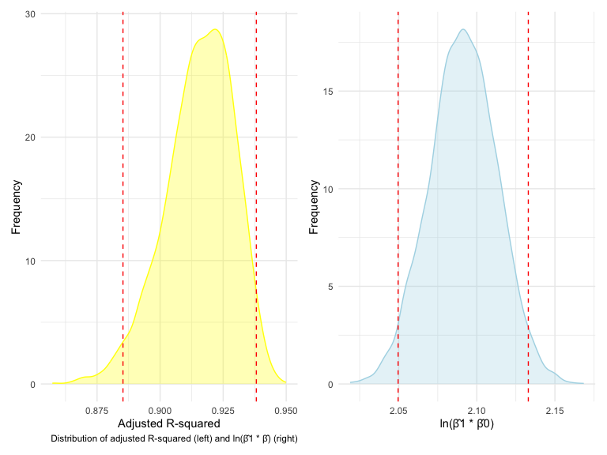

p8105_hw6_qh2283
================
2023-12-01

Problem2

``` r
weather_df = 
  rnoaa::meteo_pull_monitors(
    c("USW00094728"),
    var = c("PRCP", "TMIN", "TMAX"), 
    date_min = "2022-01-01",
    date_max = "2022-12-31") |>
  mutate(
    name = recode(id, USW00094728 = "CentralPark_NY"),
    tmin = tmin / 10,
    tmax = tmax / 10) |>
  select(name, id, everything())
```

    ## using cached file: /Users/hoc/Library/Caches/org.R-project.R/R/rnoaa/noaa_ghcnd/USW00094728.dly

    ## date created (size, mb): 2023-12-01 02:09:45.864876 (8.544)

    ## file min/max dates: 1869-01-01 / 2023-11-30

``` r
library(tidyverse)
library(patchwork)
library(modelr)
library(mgcv)
```

    ## Loading required package: nlme

    ## 
    ## Attaching package: 'nlme'

    ## The following object is masked from 'package:dplyr':
    ## 
    ##     collapse

    ## This is mgcv 1.9-0. For overview type 'help("mgcv-package")'.

## Problem1

## Problem2

``` r
#Download the data
weather_df <- 
  rnoaa::meteo_pull_monitors(
    c("USW00094728"),
    var = c("PRCP", "TMIN", "TMAX"), 
    date_min = "2022-01-01",
    date_max = "2022-12-31") |> 
  mutate(
    name = recode(id, USW00094728 = "CentralPark_NY"),
    tmin = tmin / 10,
    tmax = tmax / 10) |> 
  select(name, id, everything())
```

    ## using cached file: /Users/hoc/Library/Caches/org.R-project.R/R/rnoaa/noaa_ghcnd/USW00094728.dly

    ## date created (size, mb): 2023-12-01 02:09:45.864876 (8.544)

    ## file min/max dates: 1869-01-01 / 2023-11-30

After loading the data, we clean it up

``` r
# selects relevant columns and renames Central Park to cp_ny for simplicity
strapped_weather_df <- weather_df %>% 
  select(name, tmax, tmin) %>% 
  mutate(
    name = str_replace(name, "CentralPark_NY", "cp_ny")
  ) %>% 
  bootstrap(n = 5000) %>%                                 
  mutate(
    model = map(strap, ~lm(tmax ~ tmin, data = .x)),     
    result = map(model, broom::tidy),                    
    stat = map(model, broom::glance)                    
  )

# a cleaned and filtered df containing variables of interest
clean_weather_strap <- strapped_weather_df %>% 
  select(-model, -strap) %>%                              # removed the original strap sample and model
  rename("strap_run" = .id) %>%                           
  unnest() %>%                                           
  select(strap_run, term, estimate, adj.r.squared) %>%   
  mutate(
    term = case_when(term == "(Intercept)" ~ "beta0",     # renamed intercept to beta0
                     term == "tmin" ~ "beta1",            # renamed slope to beta1
                     TRUE ~ as.character(term))
  ) %>% 
  pivot_wider(names_from = term,                         
              values_from = estimate) %>% 
  mutate(
    estimate_log = log(beta0 * beta1)                    
  ) %>% 
  janitor::clean_names()
```

Following the cleaning and bootstrapping process, the dataset
`clean_weather_strap`, which consists of 5000 entries, comprises
variables such as `adj_r_squared`, `beta0`, `beta1`, and `estimate_log`
for each iteration of the bootstrap (`strap_run`). The distributions of
these variables will be explored through the use of density plots.

``` r
# density plot of r-squared with 2.5% and 97.5% quantile labeled
r_squared_plot <- clean_weather_strap %>% 
  ggplot(aes(x = adj_r_squared)) +
  geom_density(color = "yellow", fill = "yellow", alpha = 0.3) +
  geom_vline(xintercept = c(quantile(pull(clean_weather_strap, adj_r_squared), probs = 0.025),
                            quantile(pull(clean_weather_strap, adj_r_squared), probs = 0.975)),
             linetype = "dashed",
             color = "red") +
  labs(x = "Adjusted R-squared",
       y = "Frequency",
       caption = "Distribution of adjusted R-squared (left) and ln(β̂1 * β̂) (right)")

# density plot of ln(beta0 * beta1) with 2.5% and 97.5% quantile labeled
estimate_log_plot <- clean_weather_strap %>% 
  ggplot(aes(x = estimate_log)) +
  geom_density(color = "lightblue", fill = "lightblue", alpha = 0.3) +
  geom_vline(xintercept = c(quantile(pull(clean_weather_strap, estimate_log), probs = 0.025),
                            quantile(pull(clean_weather_strap, estimate_log), probs = 0.975)),
             linetype = "dashed",
             color = "red") +
  labs(x = "ln(β̂1 * β̂0)",
       y = "Frequency")

# use patchwork to print them side-by-side
r_squared_plot + estimate_log_plot
```



Similar to the distribution of $r^2$, this distribution also exhibits a
degree of skewness and includes some outliers.

The key takeaway here isn’t to always rely on the bootstrap method. In
many instances, it’s feasible to determine “large sample” distributions
for unusual parameters, values, or summaries, which are quite valuable.
However, it’s beneficial to understand that bootstrap offers a solution
for conducting inferences in more challenging scenarios.
